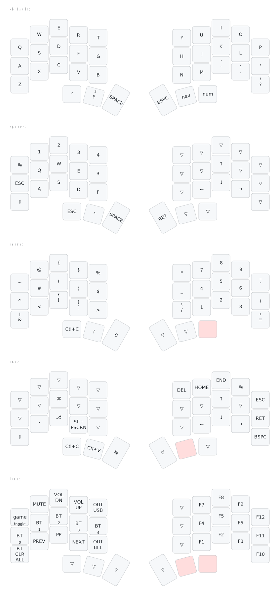

# Temper ZMK Config

This is my personal ZMK config for the [temper](https://github.com/raeedcho/temper).

Changes from @raeedcho's design:
 - default layer changed to QWERTY
 - added extra action buttons

